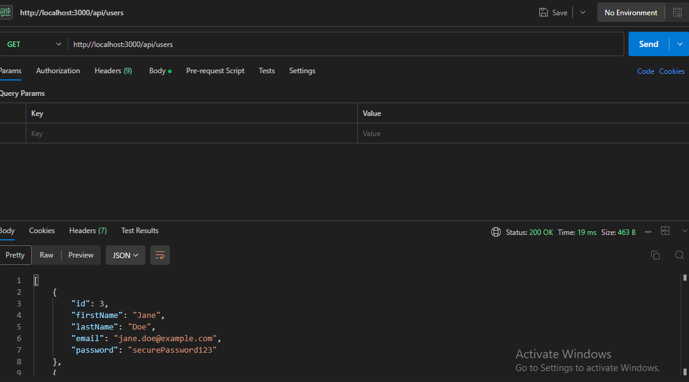
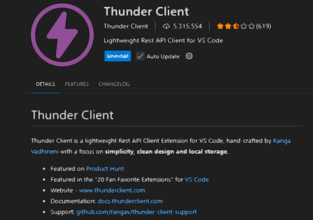
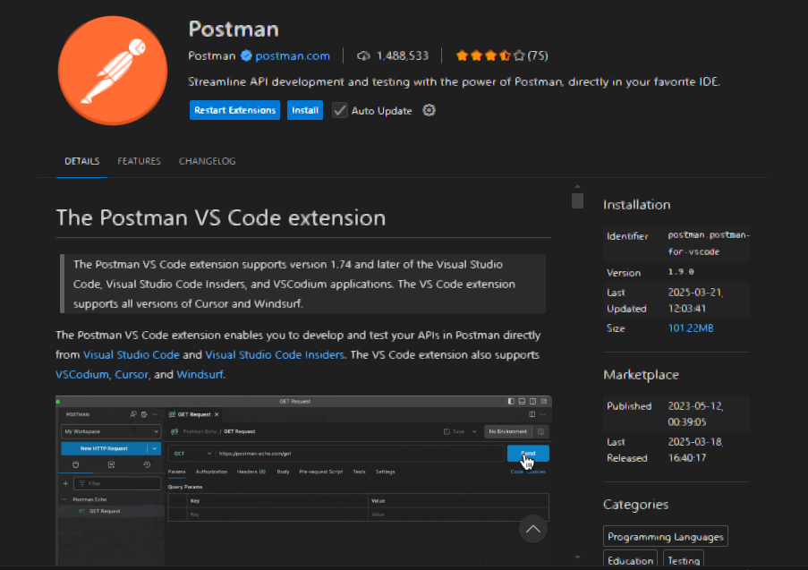

# Group project of REST API for User Mangement

# I. Project Overview
The CRUD (Create, Read, Update, Delete) features of the API are intended for user management. It enables the use of Node.js, Express, TypeORM, MySQL, and TypeScript to manage user accounts in a database. In order to ensure effective user data handling and management, the API offers endpoints for creating new users, retrieving user details, updating user information, and deleting users.

# II. Setup Instructions

1. After the repository is created and provided by the leader, run this command in your terminal.
    -> "git clone [text](https://github.com/Rodriguez1718/user-management-api)"
2. Install all dependencies needed.
    -> "npm i @types/express dotenv express mysql12 reflect-metadata typeorm"
    -> npm i --save-dev @typesnode typescript ts-node
3. We will then set up our data-source.ts with our MYSQL credentials for the database connection.
    

# III. API Documentation

CREATION OF USERS - PATAC
    ! 

DELETING OF USERS - LANGOMEZ
    ! 

RETRIEVING USER DETAILS - CASTILLO
     

# IV. Testing

1. We Used POSTMAN and ThunderClient for the testing of API.
     
     

2. Make sure that your sql is running first.

3. Run "npm run dev" in your terminal, you will see a message saying the serving is listening at port 3000

4. You can now test in Postman or Thunder Client.

# V. MERGE CONFLICT 

    During the process of creating our application, we encountered a conflict. And basically we were able to resolve the 
    conflict.

