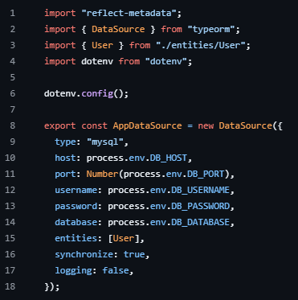

# Group project of REST API for User Mangement

# I. Project Overview
The CRUD (Create, Read, Update, Delete) features of the API are intended for user management. It enables the use of Node.js, Express, TypeORM, MySQL, and TypeScript to manage user accounts in a database. In order to ensure effective user data handling and management, the API offers endpoints for creating new users, retrieving user details, updating user information, and deleting users.

# II. Setup Instructions

1. After the repository is created and provided by the leader, run this command in your terminal.
    -> "git clone (https://github.com/Rodriguez1718/user-management-api)"
2. Install all dependencies needed.
    -> "npm i @types/express dotenv express mysql12 reflect-metadata typeorm"
    -> npm i --save-dev @typesnode typescript ts-node
3. We will then set up our data-source.ts with our MYSQL credentials for the database connection.
    

# III. API Documentation

CREATION OF USERS - PATAC
  

DELETING OF USERS - LANGOMEZ

RETRIEVING USER DETAILS - CASTILLO
    

# IV. Testing
API Documentation

Register a New User
Endpoint: POST /users

Request Body:

{ "email": "john.doe@example.com", "password": "securepassword", "confirmPassword": "securepassword", "title": "Mr", "firstName": "John", "lastName": "Doe", "role": "admin" }

Response:

{ "id": 1, "email": "john.doe@example.com", "title": "Mr", "firstName": "John", "lastName": "Doe", "role": "admin", "message": "User registered successfully" }

Validation Rules:

email: Must be valid and unique.

password: Minimum 8 characters, must match confirmPassword.

title: Required, e.g., "Mr", "Ms", "Dr".

firstName & lastName: Required, min 2 characters.

role: Default is "user", valid values are "user" or "admin".

Get All Users
Endpoint: GET ALL USERS /users

[ { "id": 1, "email": "john.doe@example.com", "password": "securepassword", "title": "Mr", "firstName": "John", "lastName": "Doe", "role": "admin" }, { "id": 2, "email": "john1.doe@example.com", "password": "securepassword", "title": "Mr", "firstName": "John", "lastName": "Doe", "role": "admin" } ]

Get User by ID
Endpoint: GET api/users/:id

Example Request:

GET http://localhost:3000/api/users/1

Response:

{ "id": 1, "email": "john.doe@example.com", "title": "Mr", "firstName": "John", "lastName": "Doe", "role": "admin" }

Note: Passwords are not included in the response for security.

Update User
Endpoint: PUT api/users/:id

Request Body:

{ "email": "john.doe@example.com", "title": "Dr", "firstName": "John", "lastName": "Smith", "role": "admin" }

Response:

{ "message": "User updated successfully" }

Delete User
Endpoint: DELETE api/users/:id

Example Request:

DELETE http://localhost:3000/api/users/1

1. We Used POSTMAN and ThunderClient for the testing of API.

3. Run "npm run dev" in your terminal, you will see a message saying the serving is listening at port 3000

4. You can now test in Postman or Thunder Client.

